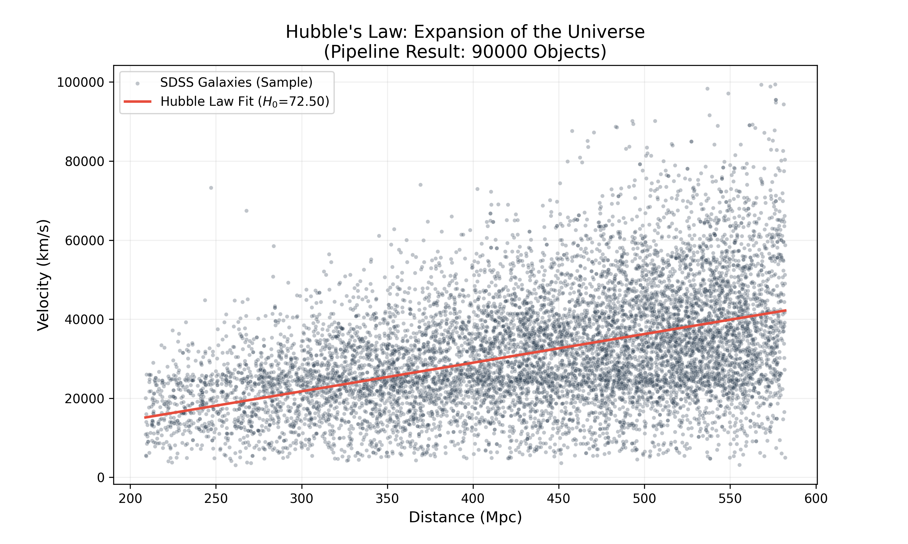

# SDSS Cosmological Data Pipeline
**An Operational ETL Workflow for Hubble's Law Validation**



## 1. Overview
This repository contains a professional-grade **ETL (Extract, Transform, Load)** pipeline designed to process large-scale astronomical data from the **Sloan Digital Sky Survey (SDSS)**. The project demonstrates the ability to handle massive datasets (15M+ records) by implementing memory-efficient chunking and vectorized physics transformations.

## 2. Scientific Background
The pipeline validates **Hubble’s Law**, which describes the expansion of the universe:

$$v = H_0 \cdot d$$

Where:
* $v$: Recessional velocity of a galaxy.
* $H_0$: The Hubble Constant (rate of expansion).
* $d$: Proper distance to the galaxy.

### The Physics Workflow
1.  **Redshift-to-Velocity:** Calculated using the Doppler approximation for cosmological distances: $v = c \cdot z$.
2.  **Distance Modulus:** Distances are derived from the relationship between apparent magnitude ($m$) and absolute magnitude ($M$):
    $$d = 10^{\frac{m - M + 5}{5}}$$
3.  **Statistical Regression:** A linear fit is applied to the Velocity-Distance relationship to derive $H_0$.


## 3. Engineering & Operational Features
To meet the requirements of an institutional data segment (aligning with **KNMI/TROPOMI** operational standards), this pipeline includes:

* **Memory-Efficient Chunking:** Utilizing Python generators and Pandas chunking to process data batches, ensuring stable execution for volumes exceeding available RAM.
* **Operational Logging:** Implemented the `logging` library for robust process monitoring, replacing standard print statements for better traceability.
* **Data Hygiene:** Automated outlier removal using quantile filtering to maintain statistical integrity.
* **Interoperability:** Outputs standardized CSV formats ready for downstream scientific validation and long-term archiving.

## 4. Technical Stack
* **Language:** Python 3.9+
* **Libraries:** `Pandas` (ETL), `NumPy` (Vectorized Math), `SciPy` (Physics), `Scikit-Learn` (Regression), `Matplotlib/Seaborn` (Visualization), `Astroquery` (Data Access).
* **Version Control:** Managed via Git with professional repository hygiene (`.gitignore`).

## 5. How to Run
1. **Clone the repository:**
   ```bash
   git clone [https://github.com/syd311/SDSS-Data-Pipeline.git](https://github.com/syd311/SDSS-Data-Pipeline.git)
2. **Install the dependencies:**
   ```bash
   pip install numpy pandas astroquery scikit-learn matplotlib seaborn
3.**Execute the pipeline:**
   ```bash
   python sdss_etl_pipeline.py